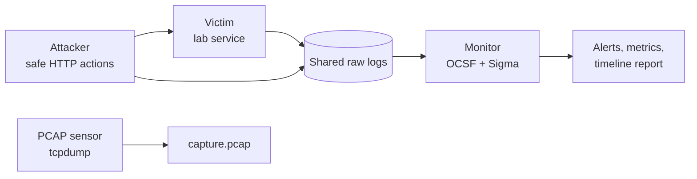

# Detection Time Machine

A small, reproducible cyber range that records a safe attack simulation, normalizes the resulting telemetry into OCSF-shaped events, evaluates Sigma-style rules, and measures detection quality.

Built this because I wanted a fast way to answer "would my detections actually catch this?" without spinning up a full lab every time. Everything's deterministic and safe to run in CI — nothing here actually executes an attack.

## What it simulates

| Action | MITRE ATT&CK | Telemetry | Detection |
|---|---|---|---|
| Password guessing | T1110.001 | Authentication + network | Failed password rule |
| Valid lab account | T1078 | Authentication + network | Timeline context |
| Simulated shell command | T1059.004 | HTTP + endpoint + network | Admin endpoint and command-line rules |

The "shell command" step is **never executed**. The victim writes a process-shaped event with `simulated: true`, so this is safe to run anywhere including CI.

## Quick Start

Only requirement is Python 3.11+.

```bash
make test
make gui
make demo
make replay
```

`make gui` opens a local web interface at http://127.0.0.1:8765 where you can run the deterministic demo, replay the latest recording, inspect metrics/alerts/OCSF telemetry, and open the generated timeline report.

If port 8765 is already in use, the GUI automatically tries the next available port and prints the URL to open.

You can also just run the demo from the CLI and open `artifacts/latest/report.html` directly. The recording also contains:

```text
artifacts/latest/
├── raw/                         # attacker, auth, endpoint, app, network logs
├── ocsf-events.jsonl            # normalized telemetry
├── alerts.jsonl                 # Sigma detections
├── benign-ocsf-events.jsonl     # negative-control telemetry
├── benign-alerts.jsonl          # should be empty
├── metrics.json                 # coverage, FP rate, TTD
└── report.html                  # action → telemetry → alert timeline
```

Replay a recording after changing or adding rules:

```bash
make replay
```

Run the GUI headless:

```bash
PYTHONPATH=src python3 -m dtm gui --no-open
```

## Container Range

With Docker installed:

```bash
make docker-demo
```

Compose spins up an internal-only network with four services:



- `attacker` — runs the deterministic ATT&CK-mapped scenario and exits
- `victim` — exposes only the intentionally limited lab API
- `monitor` — normalizes logs, evaluates rules, produces the report
- `pcap` — captures port 8080 traffic from the victim network namespace

Containers are read-only with `no-new-privileges`, and only share the experiment artifact directory. The range network is `internal: true` — the "command" step uses inert `example.invalid` text and never actually runs.

## Detection Rules

Rules live in `rules/*.yml`. They're actually JSON documents with a YAML extension — JSON is a strict subset of YAML, so they stay valid YAML while keeping the project dependency-free.

Supported Sigma subset:

- Nested fields (e.g. `process.cmd_line`)
- Equality
- `contains`, `startswith`, `endswith`, `re` modifiers
- Conditions built from named selections with `and`, `or`, `not`

Keeps replay behavior easy to reason about. If you wanted to take this further, you could compile the same rules with pySigma and ship OCSF events to Elastic, Splunk, Loki, etc.

## Measurements

`metrics.json` records:

- **Detection coverage** — expected scenario rule IDs that fired
- **False positives** — alerts generated by the benign control fixture
- **False-positive rate** — benign alerts ÷ benign events
- **Time to detect** — first alert timestamp minus first attacker action
- **Missed/unexpected rules** — useful as CI quality gates

The GitHub Actions workflow runs unit tests, creates a fresh recording, enforces 100% expected coverage and zero benign alerts, then uploads the recording.

## Extending it

1. Add a scenario JSON file with ATT&CK IDs and deterministic steps
2. Add a victim endpoint or sensor that emits a new raw event type
3. Map the event in `src/dtm/normalize.py`
4. Add a rule and its ID to `expected_rules`
5. Add benign examples that resemble normal use
6. Run `make test`, `make demo`, and replay prior recordings

See [docs/architecture.md](docs/architecture.md) for system boundaries and design choices.
