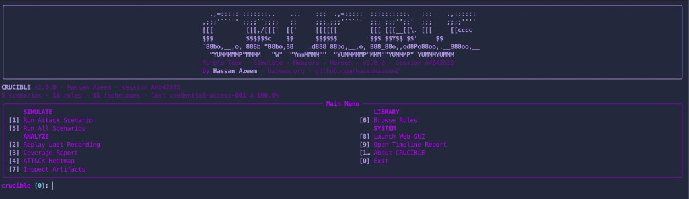
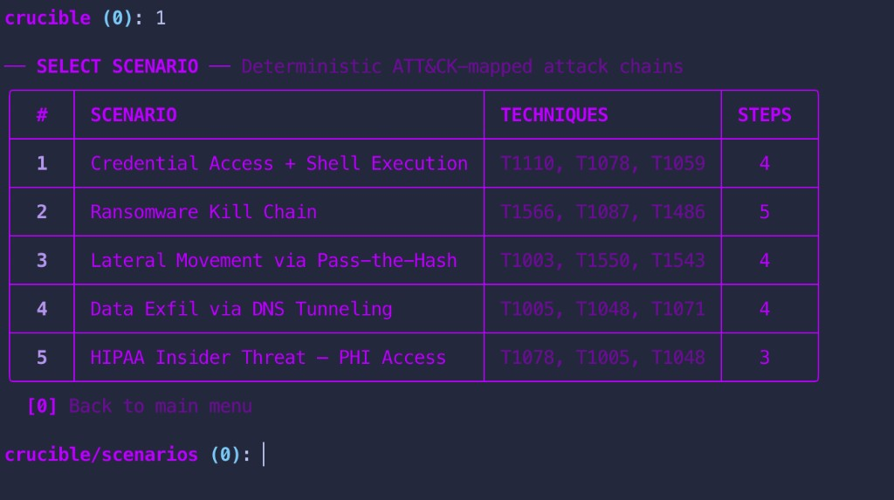
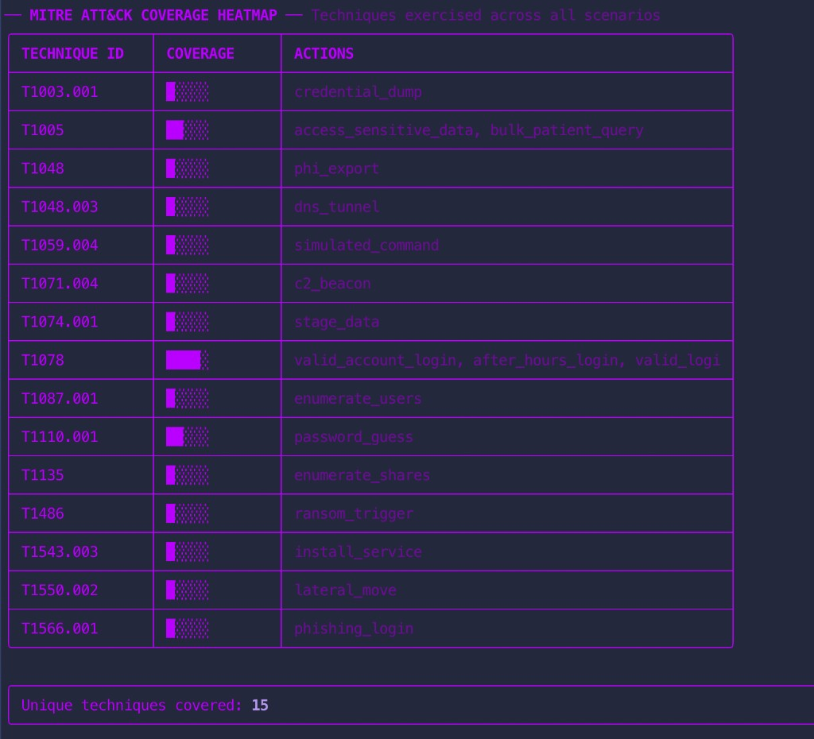
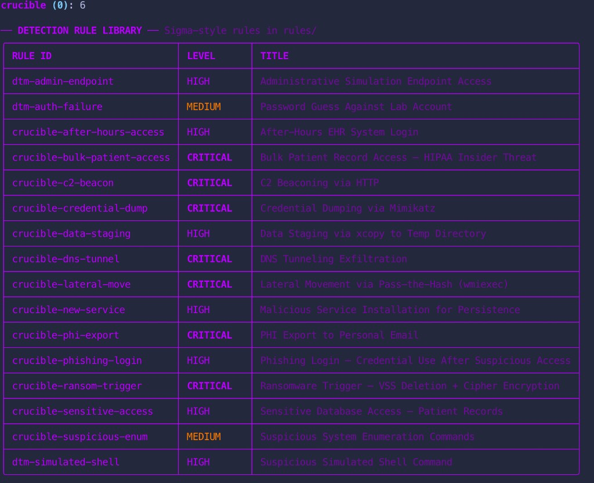
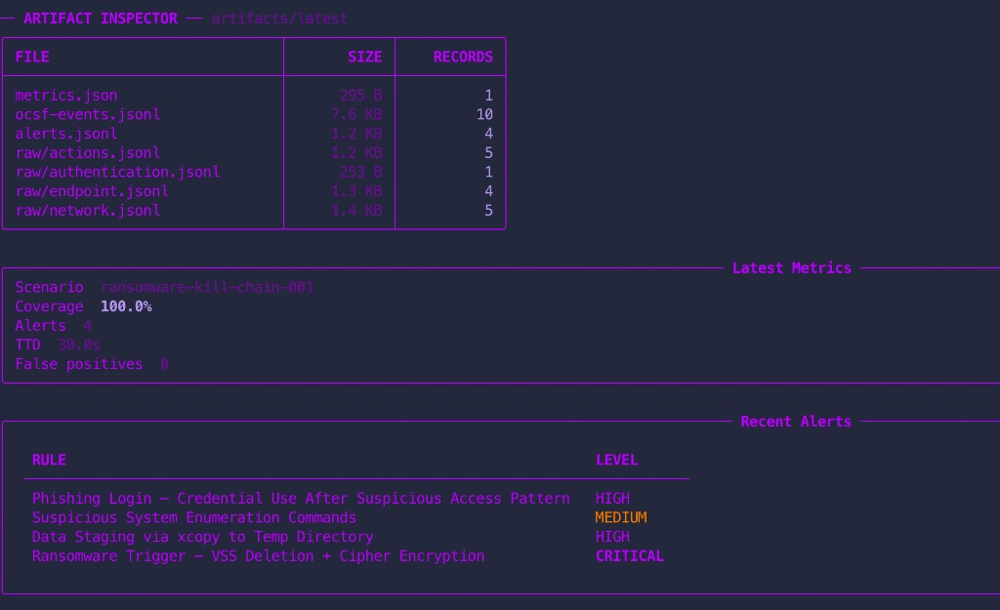
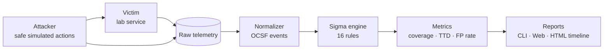

# Crucible (DTM v2)

**Crucible** is a reproducible purple-team lab by **Hassan Azeem** that answers one question fast:

> *Would my detections actually catch this?*

It simulates safe ATT&CK-mapped attack chains, normalizes the resulting telemetry into OCSF-shaped events, evaluates Sigma-style rules, and measures detection quality — without ever executing real attacks.

- **Author:** Hassan Azeem · [hazeem.org](https://hazeem.org) · [github.com/hassanazeem2](https://github.com/hassanazeem2)
- **Version:** 2.0.0
- **Status:** Deterministic, CI-safe, local-first

## Why I built this

Detection engineering often gets stuck between two bad options: spin up a full lab for every rule change, or trust that a query *looks* right on paper. I built Crucible to sit in the middle — a fast, repeatable way to simulate attacker behavior, replay telemetry, and measure whether detections actually fire when they should (and stay quiet when they shouldn't).

Crucible is the evolution of **Detection Time Machine (DTM v2)**: same reproducible engine, now with an interactive CLI, richer scenarios, a web GUI, and measurable purple-team workflows.

## Quick start

Python 3.11+ is the only requirement.

```bash
pip install rich pyfiglet
make test
make crucible
make gui
make demo
make replay
```

Launch the interactive CLI:

```bash
python crucible.py
```

Launch the web GUI:

```bash
make gui
```

## CLI showcase

The terminal interface is the primary way to explore Crucible — run scenarios, inspect artifacts, browse rules, and review ATT&CK coverage without touching the command line for every step.

### Main menu


### Scenario library



Five deterministic ATT&CK-mapped chains ship out of the box:

| Scenario | Techniques | Steps | Expected rules |
|---|---:|---:|---:|
| Credential Access + Shell Execution | T1110, T1078, T1059 | 4 | 3 |
| Ransomware Kill Chain | T1566, T1087, T1486 | 5 | 4 |
| Lateral Movement via Pass-the-Hash | T1003, T1550, T1543 | 4 | 4 |
| Data Exfil via DNS Tunneling | T1005, T1048, T1071 | 4 | 4 |
| HIPAA Insider Threat — PHI Access | T1078, T1005, T1048 | 3 | 3 |

### ATT&CK coverage heatmap



### Detection rule library



Crucible ships **16 Sigma-style rules** across credential access, ransomware, lateral movement, exfiltration, and HIPAA insider-threat patterns.

### Artifact inspector



Every run produces a complete recording:

```text
artifacts/latest/
├── raw/                         # attacker, auth, endpoint, app, network logs
├── ocsf-events.jsonl            # normalized telemetry
├── alerts.jsonl                 # Sigma detections
├── benign-ocsf-events.jsonl     # negative-control telemetry
├── benign-alerts.jsonl          # should be empty
├── metrics.json                 # coverage, FP rate, TTD
└── report.html                  # action → telemetry → alert timeline
```

## Architecture



## Measurement model

`metrics.json` captures the experiment quality gates:

| Metric | What it tells you |
|---|---|
| **Detection coverage** | Expected scenario rule IDs that fired |
| **Time to detect** | First alert minus first attacker action |
| **False positives** | Alerts generated by benign control traffic |
| **False-positive rate** | Benign alerts divided by benign events |
| **Missed / unexpected rules** | Gaps in expected detection behavior |

Example output from a successful ransomware scenario run:

| Metric | Value |
|---|---:|
| Scenario | `ransomware-kill-chain-001` |
| Coverage | 100% |
| Alerts | 4 |
| Time to detect | 30.0s |
| False positives | 0 |

## Safety model

Nothing in Crucible executes real attacks. Simulated shell commands, credential dumps, ransomware triggers, and exfiltration steps are written as **telemetry-only events** with `simulated: true`. That makes the range safe to run locally, in CI, and in shared lab environments.

## Web GUI

Crucible also includes a local web interface for demo runs, replay, metrics, alerts, OCSF telemetry, and timeline inspection.

```bash
make gui
```

If port `8765` is busy, the GUI automatically tries the next available port and prints the URL to open.

## Container range

With Docker installed:

```bash
make docker-demo
```

Compose creates an internal-only network with attacker, victim, monitor, and PCAP services — the same reproducible pipeline, packaged for container workflows.

## Extending Crucible

1. Add a scenario JSON file with ATT&CK IDs and deterministic steps under `scenarios/`.
2. Add a Sigma-style rule under `rules/`.
3. Map any new raw event types in `src/dtm/normalize.py`.
4. Add benign negative-control examples under `fixtures/benign/`.
5. Run `make test`, `python crucible.py`, and replay prior recordings.

See [docs/architecture.md](docs/architecture.md) for system boundaries and design choices.

## About the author

**Hassan Azeem** builds security tooling that makes detection work practical — fast feedback loops, reproducible experiments, and interfaces that help analysts and engineers actually use the results. Crucible is part of that work: a purple-team lab you can run in minutes, not days.

- Website: [hazeem.org](https://hazeem.org)
- GitHub: [github.com/hassanazeem2](https://github.com/hassanazeem2)
